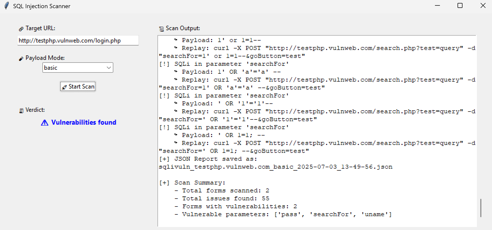
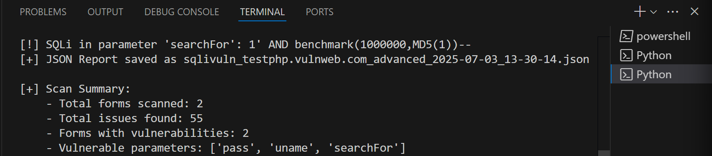
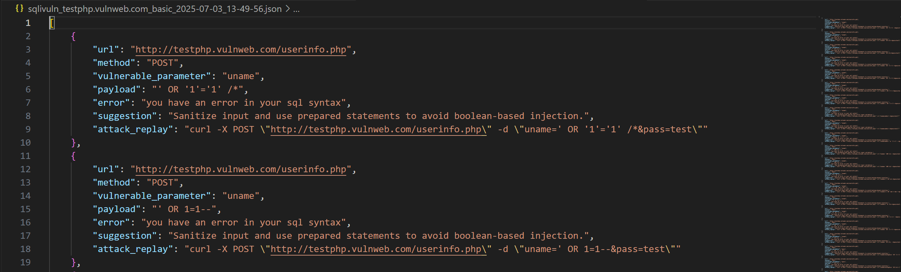

# 🛡️ SQL Injection Vulnerability Scanner


---

## 🧠 What is SQL Injection?

**SQL Injection (SQLi)** is one of the most common and dangerous vulnerabilities in web applications.  
It happens when attackers trick a website into executing **unauthorized database commands** by inserting special inputs into a form field.

Think of it like giving the wrong command to a vending machine to get **free snacks** — except here, it’s confidential data like passwords or admin access.

---

## 💥 Simple Example
Let’s say a login form asks you:
```
Username: _______
Password: _______
```

You enter this:

```
Username: admin
Password: ' OR '1'='1
```

Instead of logging in normally, this **confuses the website**, and it gives access **without checking the password** — because the input **alters the database query** behind the scenes.

✅  Result: You're in. No password needed.  
⚠️ Risk: Total database compromise if not fixed.

---

## 🛡️ What This Tool Does

This tool scans any website URL you give it, finds the input forms (like login, search, signup), and **tests them automatically** with both basic and advanced SQL injection payloads.

It tells you:

- Which forms are vulnerable  
- Which specific fields (like `username`, `search`) are at risk  
- The actual payload that caused the issue  
- A **replay command** to test it manually  
- A safe **fix suggestion** for developers

---

## 🖼️ Tool in Action+

### 🎯 Graphical User Interface



- Simple, beginner-friendly GUI
- Real-time logging and vulnerability summary
- Clearly shows the verdict: ✅ Safe or ⚠️ Vulnerabilities Found

---

### 🧪 Terminal Output



- You can also run this tool from the command line.
- The tool prints a complete summary and stores a structured JSON report.

---

### 📁 Sample JSON Report



- Report includes:
  - Vulnerable parameter
  - Error signature detected
  - Payload used
  - Curl replay command
  - Auto-generated fix recommendation

---

## 🚀 How to Run

### 📦 Prerequisites
- Python 3.10 or higher
- `requests`, `bs4`, and `tkinter` installed

```bash
pip install -r requirements.txt
```
### 🖥️ Run the GUI Version
```bash
python gui.py
```
### ⚙️ Run in Terminal (CLI)
```bash
python main.py
```
You will be prompted to enter:

```bash
Target URL
Payload mode (basic / advanced)
```

📂 Project Structure

```bash
.
├── gui.py                # Tkinter-based GUI frontend
├── main.py               # Core scanning engine
├── payloads.json         # Basic & Advanced SQLi payloads
├── sqlivuln_*.json       # Generated reports
├── assets/               # Screenshots and visuals for README
└── README.md
```

## 🔍 Features

- 🔎 Automatic SQL Injection testing
- 🧠 Payload mode: basic and advanced
- 📋 Curl-based attack replay generation
- 🧪 Real-time logging (CLI + GUI)
- 🧾 Summary + JSON reporting
- 💡 Auto-generated fix recommendations
- ✅ Verdict section for non-technical stakeholders

## 💻 Tech Stack

- Python 3.10+
- Tkinter (GUI)
- Requests + BeautifulSoup (Web scraping)
- JSON / Regex / URL parsing

## ✅ Sample Output Summary

```bash
[+] Scan Summary:
    - Total forms scanned: 2
    - Total issues found: 55
    - Forms with vulnerabilities: 2
    - Vulnerable parameters: ['searchFor', 'uname', 'pass']
```

📜 License
**⚠️ This tool is for educational and ethical testing purposes only.**  
Do **not** use on systems you don’t own or don’t have permission to test.
